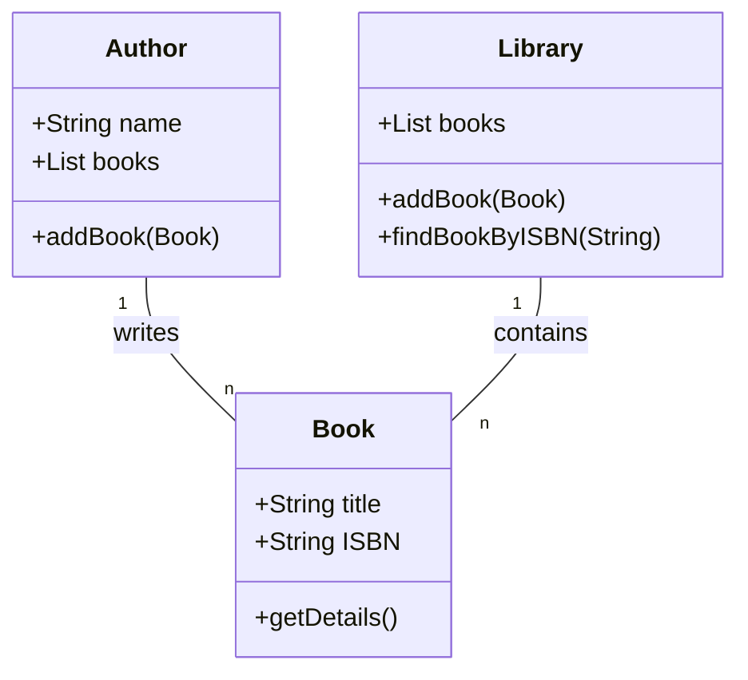
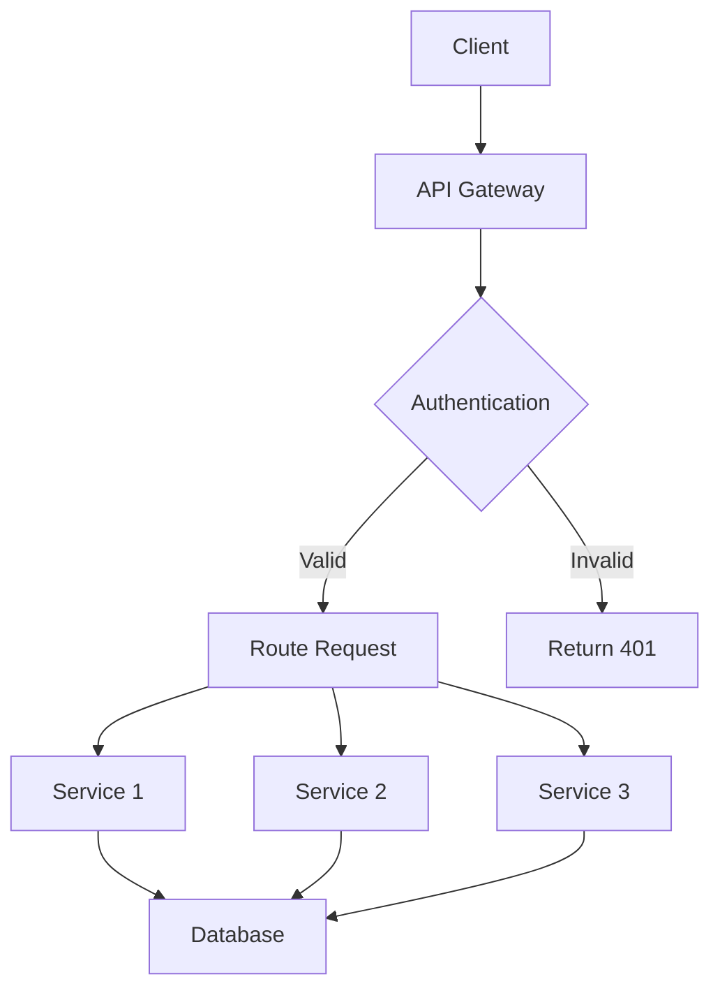

# Archy - Architectural Diagram Builder

Archy is an MCP (Model Context Protocol) server that generates architectural diagrams using Mermaid syntax. It can process both natural language descriptions and GitHub repository URLs to create various types of diagrams.

## Features

- Generate diagrams from text descriptions
- Generate diagrams from GitHub repositories
- Support for all Mermaid diagram types:
  - Flowcharts
  - Sequence Diagrams
  - Class Diagrams
  - State Diagrams
  - Entity Relationship Diagrams
  - User Journeys
  - Gantt Charts
  - Pie Charts
  - Quadrant Charts
  - Requirement Diagrams
  - Git Graphs
  - C4 Diagrams

## Installation

### Prerequisites

- Node.js (v16 or higher)
- npm (v7 or higher)
- TypeScript (v5.8 or higher, included in dependencies)

### Install from Source

1. Clone the repository:
   ```bash
   git clone https://github.com/yourusername/archy.git
   cd archy
   ```

2. Install dependencies:
   ```bash
   npm install
   ```

3. Build the project:
   ```bash
   npm run build
   ```
   This compiles the TypeScript source files to JavaScript in the `build` directory.

### Automated MCP Installation

Archy includes a convenient installation script that automatically configures the MCP server for both VS Code and Claude:

```bash
npm run install-mcp
```

This script:
- Automatically detects the correct MCP settings locations for your operating system
- Updates the MCP configuration files for VS Code and Claude
- Prompts for a GitHub token for repository analysis (optional)
- Makes the server executable

No need to manually edit JSON configuration files like some kind of cave-dwelling animal! The script handles all the tedious configuration work for you, so you can focus on creating beautiful diagrams instead of wrestling with file paths and permissions.

### Configuration

Archy can be configured using environment variables:

- `GITHUB_TOKEN`: GitHub API token for authenticated requests (optional)

## Usage

### MCP Integration

To use Archy with an MCP client, add it to your MCP settings file if you're a masochist:

```json
{
  "mcpServers": {
    "archy": {
      "command": "node",
      "args": ["/path/to/archy/build/index.js"],
      "env": {
        "GITHUB_TOKEN": "your-github-token"
      }
    }
  }
}
```

### Available Tools

#### generate_diagram_from_text

Generates a Mermaid diagram from a text description.

**Parameters:**
- `description`: Text description of the diagram to generate
- `diagramType`: Type of diagram to generate (e.g., 'flowchart', 'classDiagram', etc.)

**Example:**
```json
{
  "description": "A user authentication system with login, registration, and password reset",
  "diagramType": "flowchart"
}
```

#### generate_diagram_from_github

Generates a Mermaid diagram from a GitHub repository.

**Parameters:**
- `repoUrl`: URL of the GitHub repository
- `diagramType`: Type of diagram to generate (e.g., 'classDiagram', 'sequenceDiagram', etc.)

**Example:**
```json
{
  "repoUrl": "https://github.com/username/repository",
  "diagramType": "classDiagram"
}
```

#### list_supported_diagram_types

Lists all supported diagram types with descriptions.

**Parameters:** None

## Examples

### Generating a Class Diagram from Text

```
generate_diagram_from_text({
  "description": "Create a class diagram for a library system with Book, Author, and Library classes. Books have titles and ISBNs. Authors have names and can write multiple books. Libraries contain many books.",
  "diagramType": "classDiagram"
})
```

Result:


### Generating a Flowchart from GitHub

```
generate_diagram_from_github({
  "repoUrl": "https://github.com/username/api-service",
  "diagramType": "flowchart"
})
```

Result:


## Development

### Running in Development Mode

To run the server in development mode with automatic reloading:

```bash
npm run dev
```

This uses `nodemon` and `ts-node` to run the TypeScript code directly without a separate build step, automatically restarting when files change.

### Running the TypeScript Compiler

You can run the TypeScript compiler directly using the following methods:

#### Using the locally installed TypeScript

```bash
# Using npx to run the local TypeScript installation
npx tsc

# Compile with specific tsconfig file
npx tsc --project tsconfig.json

# Watch mode - automatically recompile when files change
npx tsc --watch

# Compile specific files
npx tsc src/index.ts src/server.ts
```

#### Using globally installed TypeScript

If you have TypeScript installed globally:

```bash
# Install TypeScript globally (if not already installed)
npm install -g typescript

# Run the TypeScript compiler
tsc

# Compile with specific tsconfig file
tsc --project tsconfig.json

# Watch mode
tsc --watch
```

#### Common TypeScript Compiler Options

- `--outDir <directory>`: Specify output directory for compiled files
- `--target <ES version>`: Specify ECMAScript target version (e.g., ES2020)
- `--module <module system>`: Specify module system (e.g., NodeNext)
- `--declaration`: Generate .d.ts declaration files
- `--sourceMap`: Generate source map files for debugging
- `--strict`: Enable all strict type checking options
- `--noEmit`: Check for errors without generating output files
- `--noImplicitAny`: Raise error on expressions with implied 'any' type

For a complete list of compiler options, run `npx tsc --help` or refer to the [TypeScript documentation](https://www.typescriptlang.org/docs/handbook/compiler-options.html).

### TypeScript Configuration

Archy is built with TypeScript using the following configuration:

```json
{
  "compilerOptions": {
    "target": "ES2020",
    "module": "NodeNext",
    "moduleResolution": "NodeNext",
    "esModuleInterop": true,
    "strict": true,
    "outDir": "build",
    "declaration": true,
    "sourceMap": true,
    "resolveJsonModule": true
  },
  "include": ["src/**/*"],
  "exclude": ["node_modules", "build"]
}
```

Key TypeScript features used:
- ES2020 target for modern JavaScript features
- NodeNext module resolution for compatibility with Node.js
- Declaration files generation for better type support
- Source maps for easier debugging


### Project Structure

- `src/`: TypeScript source files
  - `src/index.ts`: Main entry point and server implementation
  - `src/server.ts`: Server implementation
  - `src/generators/`: Diagram generation logic
  - `src/utils/`: Utility functions and helpers
- `build/`: Compiled JavaScript output
- `examples/`: Example usage scripts
- `test/`: Test files

## License

MIT License

Copyright (c) 2025 Mark Scott

Permission is hereby granted, free of charge, to any person obtaining a copy
of this software and associated documentation files (the "Software"), to deal
in the Software without restriction, including without limitation the rights
to use, copy, modify, merge, publish, distribute, sublicense, and/or sell
copies of the Software, and to permit persons to whom the Software is
furnished to do so, subject to the following conditions:

The above copyright notice and this permission notice shall be included in all
copies or substantial portions of the Software.

THE SOFTWARE IS PROVIDED "AS IS", WITHOUT WARRANTY OF ANY KIND, EXPRESS OR
IMPLIED, INCLUDING BUT NOT LIMITED TO THE WARRANTIES OF MERCHANTABILITY,
FITNESS FOR A PARTICULAR PURPOSE AND NONINFRINGEMENT. IN NO EVENT SHALL THE
AUTHORS OR COPYRIGHT HOLDERS BE LIABLE FOR ANY CLAIM, DAMAGES OR OTHER
LIABILITY, WHETHER IN AN ACTION OF CONTRACT, TORT OR OTHERWISE, ARISING FROM,
OUT OF OR IN CONNECTION WITH THE SOFTWARE OR THE USE OR OTHER DEALINGS IN THE
SOFTWARE.
