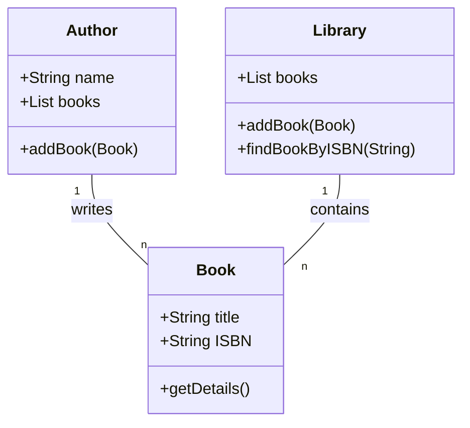
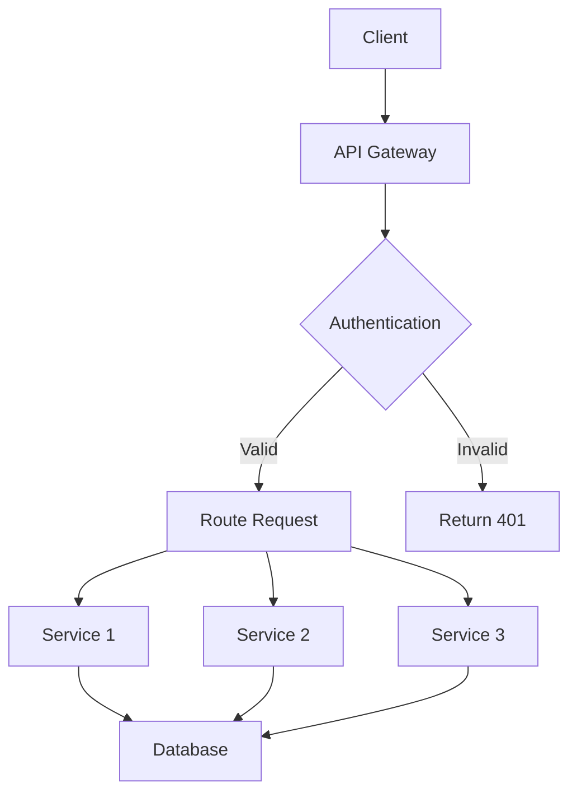

<a href="https://glama.ai/mcp/servers/@phxdev1/archy-mcp">
  
</a>
# Archy - Architectural Diagram Builder

Archy is an MCP (Model Context Protocol) server that generates architectural diagrams using Mermaid syntax. It can process both natural language descriptions and GitHub repository URLs to create various types of diagrams.

## Features

- Generate diagrams from text descriptions
- Generate diagrams from GitHub repositories
- Support for all Mermaid diagram types:
  - Flowcharts
  - Sequence Diagrams
  - Class Diagrams
  - State Diagrams
  - Entity Relationship Diagrams
  - User Journeys
  - Gantt Charts
  - Pie Charts
  - Quadrant Charts
  - Requirement Diagrams
  - Git Graphs
  - C4 Diagrams

## Installation

### Prerequisites

- Node.js (v16 or higher)
- npm (v7 or higher)
- TypeScript (v5.8 or higher, included in dependencies)

### Install from Source

1. Clone the repository:
   ```bash
   git clone https://github.com/phxdev1/archy.git
   cd archy
   ```

2. Install dependencies:
   ```bash
   npm install
   ```

3. Build the project:
   ```bash
   npm run build
   ```
   This compiles the TypeScript source files to JavaScript in the `build` directory.

### Automated MCP Installation

Archy includes a convenient installation script that automatically configures the MCP server for both VS Code and Claude:

```bash
npm run install-mcp
```

This script:
- Automatically detects the correct MCP settings locations for your operating system
- Updates the MCP configuration files for VS Code and Claude
- Prompts for a GitHub token for repository analysis (optional)
- Makes the server executable

No need to manually edit JSON configuration files like some kind of cave-dwelling animal! The script handles all the tedious configuration work for you, so you can focus on creating beautiful diagrams instead of wrestling with file paths and permissions.

## Configuration

## Configuration

Archy can be configured using environment variables:

- `GITHUB_TOKEN`: GitHub API token for authenticated requests (optional)
- `OPENROUTER_API_KEY`: OpenRouter API key for AI-powered diagram generation (optional)

### OpenRouter Integration

Archy includes integration with OpenRouter through LangChain, enabling enhanced AI-powered diagram generation. When an OpenRouter API key is configured, additional tools become available:

- **AI-Enhanced Text-to-Diagram Generation**: Generate more sophisticated diagrams from text descriptions
- **Code-to-Diagram Generation**: Analyze code and generate appropriate diagrams
- **Diff Visualization**: Generate diagrams showing differences between code versions

To use these features:

1. Sign up for an account at [OpenRouter](https://openrouter.ai/)
2. Get your API key from the OpenRouter dashboard
3. Set the `OPENROUTER_API_KEY` environment variable before running Archy

### Image Export

Archy supports exporting Mermaid diagrams to various image formats:

- **PNG**: Raster image format suitable for web and documentation
- **SVG**: Vector image format that scales without losing quality
- **PDF**: Document format suitable for printing and sharing

Images can be exported with customizable dimensions and background colors.

### Repository Evolution Tracking

Archy can analyze Git repositories to track their evolution over time:

- **In-Memory Git**: Clone and analyze repositories without writing to the file system
- **Commit History**: Track changes across multiple commits (limited to 10 by default)
- **File Evolution**: Track how specific files change over time
- **Evolution Visualization**: Generate diagrams showing the repository's evolution

### MCP Integration

To use Archy with an MCP client, add it to your MCP settings file if you're a masochist:

```json
{
  "mcpServers": {
    "archy": {
      "command": "node",
      "args": ["/path/to/archy/build/index.js"],
      "env": {
        "GITHUB_TOKEN": "your-github-token"
      }
    }
  }
}
```

### Available Tools

#### generate_diagram_from_text

Generates a Mermaid diagram from a text description.

**Parameters:**
- `description`: Text description of the diagram to generate
- `diagramType`: Type of diagram to generate (e.g., 'flowchart', 'classDiagram', etc.)

**Example:**
```json
{
  "description": "A user authentication system with login, registration, and password reset",
  "diagramType": "flowchart"
}
```

#### generate_diagram_from_github

Generates a Mermaid diagram from a GitHub repository.

**Parameters:**
- `repoUrl`: URL of the GitHub repository
- `diagramType`: Type of diagram to generate (e.g., 'classDiagram', 'sequenceDiagram', etc.)

**Example:**
```json
{
  "repoUrl": "https://github.com/username/repository",
  "diagramType": "classDiagram"
}
```

#### list_supported_diagram_types

Lists all supported diagram types with descriptions.

**Parameters:** None

### AI-Powered Tools

The following tools are available when an OpenRouter API key is configured:

#### generate_diagram_from_text_with_ai

Generates a Mermaid diagram from a text description using AI (LangChain with OpenRouter).

**Parameters:**
- `description`: Text description of the diagram to generate
- `diagramType`: Type of diagram to generate (e.g., 'flowchart', 'classDiagram', etc.)
- `useAdvancedModel`: (Optional) Whether to use a more advanced AI model for complex diagrams

**Example:**
```json
{
  "description": "A microservice architecture with user service, product service, and order service communicating through a message queue",
  "diagramType": "flowchart",
  "useAdvancedModel": true
}
```

#### generate_diagram_from_code

Generates a Mermaid diagram from code using AI.

**Parameters:**
- `code`: The code to analyze and generate a diagram from
- `diagramType`: Type of diagram to generate (e.g., 'classDiagram', 'flowchart', etc.)

**Example:**
```json
{
  "code": "class User { ... } class AuthService { ... }",
  "diagramType": "classDiagram"
}
```

#### generate_diff_diagram

Generates a Mermaid diagram showing differences between two versions of code.

**Parameters:**
- `beforeCode`: The code before changes
- `afterCode`: The code after changes
- `diagramType`: Type of diagram to generate (e.g., 'classDiagram', 'flowchart', etc.)

**Example:**
```json
{
  "beforeCode": "class User { ... }",
  "afterCode": "class User { ... additional methods ... }",
  "diagramType": "classDiagram"
}
```

#### export_diagram_to_image

Exports a Mermaid diagram to an image format (PNG, SVG, or PDF).

**Parameters:**
- `mermaidCode`: The Mermaid diagram code to export
- `format`: (Optional) The image format to export to ('png', 'svg', 'pdf', default: 'png')
- `width`: (Optional) The width of the image in pixels (default: 800)
- `height`: (Optional) The height of the image in pixels (default: 600)
- `backgroundColor`: (Optional) The background color of the image (CSS color or "transparent", default: '#ffffff')

**Example:**
```json
{
  "mermaidCode": "flowchart TD\n  A[Start] --> B[End]",
  "format": "svg",
  "width": 1200,
  "height": 800,
  "backgroundColor": "#f0f0f0"
}
```

#### generate_repository_evolution_diagram

Generates a diagram showing the evolution of a repository over time.

**Parameters:**
- `repoUrl`: URL of the GitHub repository
- `diagramType`: Type of diagram to generate (e.g., 'gitGraph', 'flowchart', etc.)
- `filepath`: (Optional) Path to a specific file to track
- `commitLimit`: (Optional) Maximum number of commits to analyze (default: 10)

**Example:**
```json
{
  "repoUrl": "https://github.com/username/repository",
  "diagramType": "gitGraph",
  "filepath": "src/main.js",
  "commitLimit": 5
}
```

## Examples

### Generating a Class Diagram from Text

```
generate_diagram_from_text({
  "description": "Create a class diagram for a library system with Book, Author, and Library classes. Books have titles and ISBNs. Authors have names and can write multiple books. Libraries contain many books.",
  "diagramType": "classDiagram"
})
```

Result:


### Generating a Flowchart from GitHub

```
generate_diagram_from_github({
  "repoUrl": "https://github.com/username/api-service",
  "diagramType": "flowchart"
})
```

Result:


## Development

### Running in Development Mode

To run the server in development mode with automatic reloading:

```bash
npm run dev
```

This uses `nodemon` and `ts-node` to run the TypeScript code directly without a separate build step, automatically restarting when files change.

### Running the TypeScript Compiler

You can run the TypeScript compiler directly using the following methods:

#### Using the locally installed TypeScript

```bash
# Using npx to run the local TypeScript installation
npx tsc

# Compile with specific tsconfig file
npx tsc --project tsconfig.json

# Watch mode - automatically recompile when files change
npx tsc --watch

# Compile specific files
npx tsc src/index.ts src/server.ts
```

#### Using globally installed TypeScript

If you have TypeScript installed globally:

```bash
# Install TypeScript globally (if not already installed)
npm install -g typescript

# Run the TypeScript compiler
tsc

# Compile with specific tsconfig file
tsc --project tsconfig.json

# Watch mode
tsc --watch
```

#### Common TypeScript Compiler Options

- `--outDir <directory>`: Specify output directory for compiled files
- `--target <ES version>`: Specify ECMAScript target version (e.g., ES2020)
- `--module <module system>`: Specify module system (e.g., NodeNext)
- `--declaration`: Generate .d.ts declaration files
- `--sourceMap`: Generate source map files for debugging
- `--strict`: Enable all strict type checking options
- `--noEmit`: Check for errors without generating output files
- `--noImplicitAny`: Raise error on expressions with implied 'any' type

For a complete list of compiler options, run `npx tsc --help` or refer to the [TypeScript documentation](https://www.typescriptlang.org/docs/handbook/compiler-options.html).

### TypeScript Configuration

Archy is built with TypeScript using the following configuration:

```json
{
  "compilerOptions": {
    "target": "ES2020",
    "module": "NodeNext",
    "moduleResolution": "NodeNext",
    "esModuleInterop": true,
    "strict": true,
    "outDir": "build",
    "declaration": true,
    "sourceMap": true,
    "resolveJsonModule": true
  },
  "include": ["src/**/*"],
  "exclude": ["node_modules", "build"]
}
```

Key TypeScript features used:
- ES2020 target for modern JavaScript features
- NodeNext module resolution for compatibility with Node.js
- Declaration files generation for better type support
- Source maps for easier debugging


### Project Structure

- `src/`: TypeScript source files
  - `src/index.ts`: Main entry point and server implementation
  - `src/server.ts`: Server implementation
  - `src/generators/`: Diagram generation logic
  - `src/utils/`: Utility functions and helpers
- `build/`: Compiled JavaScript output
- `examples/`: Example usage scripts
- `test/`: Test files
